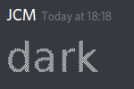
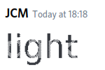

# ambimage

``ambimage`` (ambivalent + image) is a small tool to create images that look different 
depending on the theme (dark/light) they are looked at with. 

## Usage

For a quick test just run it with ``--input_dark examples/dark.png --input_light examples/light.png`` as arguments. This will create a ``output.png`` in working directory.

Post this image into Discord and look at it from light and from dark theme.
From dark theme it should look like ``examples/dark.png`` and from light theme like ``examples/light.png``.

To use your own images simply specify the paths to them in arguments.

**Be aware: These source images MUST be binary.**
To create binary images I recommend using [ImageJ](https://imagej.nih.gov/ij/), but using other image manipulation software like the GIMP is also possible.

Use ``--help`` for more options.

## Example

*Kinda bad example, 
because text usually has huge overlap, 
but I don't have better example I can publish.*

Looks like this in Discord's dark theme:

and like this in Discord's light theme:

You can clearly see the overlaps,
but with e.g. drawings it's a lot better.

## Applications

Currently only Discord is supported, but you can add own applications by creating entries in ``de.jcm.ambimage.ApplicationSpecification`` specifying

- background color of dark theme
- background color of light theme
- maximal width

### Why "maximal width"?

Some applications (e.g. Discord) scale down large imaged to preview them. Normally this works well, but with transparent images some white pixels actually get darker.

Therefore you need to specify a maximal width to which images are automatically scaled down *before* combining.

## Strategies

There are different ways to combine the images, more presisely different ways to determine which layer should be on top.

I'm not sure which is better, so currently both are implemented.

### ``WEAVE``

Both layers switch being on top each pixel, creating a chessboard-like image.

### ``FAIR``

The layers switch after each non-transparent pixel of the top layer.
